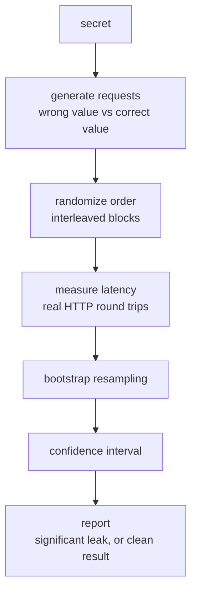

# sidecheck

How do you know your password comparison is actually constant-time?

Measure it.

> **AI-assisted ("vibe") coding has made this class of bug far more
> common.** LLMs reliably write auth comparisons that work and pass
> tests, but aren't constant-time — `if candidate == secret` is the first
> thing most models reach for unless explicitly told otherwise. If your
> login endpoint was written with Claude/Copilot/Cursor and never had a
> dedicated security review, there's a good chance nobody has checked
> this.

`sidecheck` is a CLI tool that audits your own HTTP endpoints for remote
timing side-channels — the class of bug where comparing a secret with
`==` lets an attacker recover it character-by-character by measuring
response time instead of brute-forcing the whole thing.

It's built as a measuring instrument, not an exploit: it tells you
whether a measurable timing channel exists and how confident it is, not
"here is your password."

## How it works



Network jitter is orders of magnitude larger than the signal you're
trying to detect, so naive mean/median analysis doesn't work. `sidecheck`
uses the box-test methodology from Crosby, Wallach & Riedi (ACM TISSEC,
2009) instead — full reasoning and formulas in
[docs/methodology.md](./docs/methodology.md) and
[docs/statistics.md](./docs/statistics.md).

## Example

```sh
sidecheck check https://myapp.local/login \
  --header X-API-Key \
  --secret "my-real-api-key-do-not-share"
```

```
────────────────────────────────────────────────
sidecheck timing report
────────────────────────────────────────────────

target          https://myapp.local/login
field            header X-API-Key
samples/class    12480
network jitter   1.80 ms

⚠ timing leak detected
  estimated leak         31.4 μs
  bootstrap confidence   95.0% (of the measured difference being non-zero)

  this endpoint responds measurably differently depending on
  input correctness. an attacker can exploit this to recover
  secrets character-by-character instead of brute-forcing them.

  fix: use a constant-time comparison instead of == on secret
  bytes (e.g. the `subtle` crate in Rust, `crypto/subtle` in Go,
  `hmac.compare_digest` in Python).
────────────────────────────────────────────────
sidecheck cannot prove the absence of a timing leak — only detect a
statistically significant one under the tested conditions. A clean
result here is not a safety guarantee.
generated by sidecheck 0.2.1 · seed 4891023741 (rerun with --seed 4891023741 to reproduce request order)
```

Sample size is picked automatically from a quick pilot run. Works against
a header, a query parameter, or a JSON body field:

```sh
sidecheck check https://myapp.local/api   --header X-API-Key --secret "..."
sidecheck check https://myapp.local/api   --query token      --secret "..."
sidecheck check https://myapp.local/login --json-field password --secret "..."
```

Most real login endpoints need more than just the field under test — a
`username`/`email` the backend has to look up before it even reaches the
password comparison. `--json-body` supplies the rest of the body as a
template:

```sh
sidecheck check https://myapp.local/login \
  --json-field password \
  --json-body '{"username": "admin"}' \
  --secret "..."
```

For secrets you don't want in shell history, `--value-a`/`--value-b`
advanced mode, and CI-friendly `--report`/`--output-csv` output, see
[docs/usage.md](./docs/usage.md).

## Install

```sh
cargo install --locked sidecheck
```

`--locked` matters: without it, `cargo install` re-resolves dependencies
against whatever is newest on crates.io, which can pull in transitive
crates requiring a newer Rust edition than your installed toolchain
supports. `--locked` uses the `Cargo.lock` committed in this repo, which
is known to build. MSRV is `rust-version = "1.85"` — update via
[rustup](https://rustup.rs) if your system Cargo predates that (some LTS
distros ship an older one by default).

```sh
# build from source instead
cargo build --release
./target/release/sidecheck check --help
```

## doctor: is this measurement even worth attempting?

`sidecheck doctor` is a **measurement feasibility estimator**, not just a
diagnostic ping. It answers "is this network path even capable of
resolving a leak of a realistic size" *before* you spend minutes to hours
on a full `check` — the same question `check` asks itself from its pilot
batch, surfaced up front so you can decide before committing to a
specific field or secret.

```sh
sidecheck doctor https://myapp.local/login
```

```
────────────────────────────────────────────────
sidecheck doctor
────────────────────────────────────────────────

target                https://myapp.local/login
samples                300

median RTT:            8.2 ms
RTT jitter:            0.42 ms (low)
packet loss:           0.0%
recommended samples:   ~2765881 (to reliably detect a ~1μs leak, the
                       rough scale of a real == vs constant-time bug)
environment quality:   GOOD
────────────────────────────────────────────────
this path looks suitable for timing measurement. proceed with `sidecheck check`.
```

The recommended sample count can look enormous even on a "GOOD" path —
`GOOD` means the *estimate itself* is trustworthy, not that the run will
be fast. A ~1μs leak is genuinely hard to see behind 0.42ms of jitter;
`check` will refuse to run past `--max-samples` (default 200,000) in a
case like this unless you pass `--force`. See
[docs/statistics.md](./docs/statistics.md#required-sample-size) for the
exact formula behind the recommendation.

## Limitations

**sidecheck cannot prove the absence of a timing leak.** A clean result
means no statistically significant difference was found *under the
tested conditions* — not that the endpoint is safe. Treat a positive
result as strong evidence of a bug; treat a negative result as "nothing
found here," not a certificate of safety.

Two more limits worth knowing before you trust a result: `sidecheck` has
no way to tell whether your injection point actually reached the code
path you meant to test (see `--json-body` above and
[docs/limitations.md](./docs/limitations.md)), and a genuine leak on a
short secret is often not reliably detectable over real HTTP at all — the
network noise floor can exceed a nanosecond-scale CPU leak entirely. Full
details, plus current project status, in
[docs/limitations.md](./docs/limitations.md).

## More

- [docs/methodology.md](./docs/methodology.md) — the box-test approach and why it works
- [docs/statistics.md](./docs/statistics.md) — the exact formulas
- [docs/usage.md](./docs/usage.md) — secrets handling, advanced mode, the refusal guard
- [docs/reproducibility.md](./docs/reproducibility.md) — seeds, `--repeat`, CI reports, self-verification fixtures
- [docs/limitations.md](./docs/limitations.md) — full limitations and project status
- [ROADMAP.md](./ROADMAP.md) — what's next, including a GitHub Action for CI gates
- [CHANGELOG.md](./CHANGELOG.md)

## License

MIT
