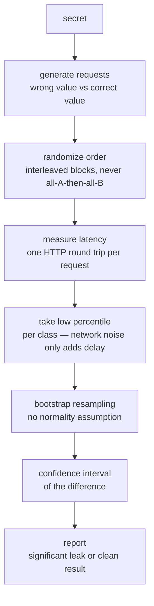

# Methodology

## Why naive timing analysis doesn't work

Naive mean/median timing analysis on network measurements is unreliable —
network jitter is orders of magnitude larger than the CPU-level signal
you're trying to detect. A real `==` vs constant-time comparison leak is
typically nanoseconds to low microseconds; ordinary network jitter over a
LAN is already milliseconds. Averaging doesn't fix this — it just averages
in the noise along with the signal.

`sidecheck` uses the methodology from Crosby, Wallach & Riedi,
*"Opportunities and Limits of Remote Timing Attacks"* (ACM TISSEC, 2009).
The core insight: **network noise can only add delay, never remove it.**
A packet can be held up by a router queue, TCP retransmit, or OS
scheduling jitter — it can never arrive early. That asymmetry means the
*fastest* observations in a sample are the ones least corrupted by noise,
and the low percentiles (p10 by default) of a sample carry far less noise
than the mean or even the raw minimum of a single run.

## The box test

A **box test** compares the low percentile of two classes of requests —
for example "correct prefix" vs "wrong prefix," or "correct secret" vs "a
random wrong value of the same length." If the low percentile of the
correct-value class is measurably higher than the wrong-value class, that
gap is evidence of a timing leak: the comparison is doing more work (and
taking longer) the more of the value it gets right.

Two methodology details that matter for trusting the result:

- **Interleaved randomization.** Request order is randomized in blocks
  (never "all A, then all B") so time-of-day drift, server warm-up, or a
  garbage collection pause doesn't get attributed to one class over the
  other just because it happened to run earlier or later.
- **Pilot-based feasibility.** Before the full run, a pilot batch
  estimates network jitter and reports how many samples are actually
  needed to detect a leak of a given size. If the network is too noisy
  for the target signal, `sidecheck` says so honestly instead of running
  for hours toward an inconclusive result. See
  [statistics.md](./statistics.md) for the exact formula, and
  [limitations.md](./limitations.md) for what a clean result does and
  doesn't mean.

## Why this matters more now

AI-assisted ("vibe") coding has made this class of bug far more common —
LLMs reliably write auth comparisons that work and pass tests, but aren't
constant-time. `if candidate == secret` is the first thing most models
reach for unless explicitly told to use a constant-time comparison, and it
looks completely correct in a code review that isn't specifically looking
for this. If your login endpoint was written with Claude/Copilot/Cursor
and never had a dedicated security review, there's a good chance nobody
has checked this.
